<h1 align="center">
  <a href="https://github.com/CommunityOfCoders/Inheritance-2024">
    
  </a>
  <br>
CrypTick: The Pump & Dump Predictor
</h1>

<div align="center">
By Team Anti Anachrony
</div>
<hr>

<details>
<summary>Table of Contents</summary>

- [Description](#description)
- [Links](#links)
- [Tech Stack](#tech-stack)
- [Progress](#progress)
- [Future Scope](#future-scope)
- [Applications](#applications)
- [Project Setup](#project-setup)
- [Team Members](#team-members)
- [Mentors](#mentors)


</details>

## 📝Description

A full-stack cryptocurrency pump and dump detection system combining blockchain oracles, machine learning, and real-time monitoring.

## 🔗Links

- [GitHub Repository](https://github.com/ShreyaR2/Cryp-Tick.git)
<!-- - [Demo Video]() -->
- [Drive Link to Screenshots of project](https://drive.google.com/drive/folders/1Naokf-RiMLKJ1WTqIB6LU3hggrGAGiG7?usp=sharing)
<!-- - [Hosted Website Link]()
- [Hosted Backend Link]() -->


## 🤖Tech-Stack
### 🏗️ System Architecture

```mermaid
graph LR
    A[🔗 On Chain Data] --> B[📜 Smart Contract]
    B --> C[⚛️ React Frontend]
    C --> D[🤖 ML Model]
    
    E[(📊 Historical Data)] --> D
    F[🌐 Node Server] --> B
    F --> C

```



### Front-end
- 
- 
- 

### Back-end
- 
- 
- 

### Blockchain
- 
- 


### ML
- 
- 
- 
- 


## 📈Progress

### Fully Implemented Features

- **Pump-and-Dump Prediction**: Analyzes market trends and transaction patterns for real-time risk assessments.
- **Coin Data Insights 📊**: Displays price stability, volume trends, and market movements.
- **Search Functionality 🔍**: Enables users to quickly access coin predictions and data.
- **Machine Learning 🤖**: Random Forest model with feature engineering, historical pattern recognition, and real-time prediction.
- **Blockchain Integration 📜**: Monitors smart contracts and integrates DEX events for market tracking.
- **Frontend Dashboard**: Interactive charts and performance metrics for coins and trading pairs.

---

### Partially Implemented Features

- **Limited Coin Support 🌐**: Predictions available for a subset of tokens; expansion planned.
- **Risk Categorization System 📈**: Ranks coins by risk level; integration in progress.


## 🔮 Future Scope

- Integration of additional coins for broader prediction coverage.
- Use of DAPIs to enable seamless integration of more coins.
- Implementation of a score-based categorization to assess risk levels.
- Development of login functionality and a customizable user dashboard.

## 💸Applications

1. **Market Manipulation Detection**  
   - Detect potential pump-and-dump schemes in real-time across cryptocurrency pairs.

2. **Risk Assessment for Traders**  
   - Assess the risk levels of different cryptocurrencies using score-based categorization.


3. **Market Analytics Platform**  
   - Provide aggregated market data, predictions, and analytics for investors and analysts.


4. **Crypto Fraud Detection System**  
   - Detect abnormal transaction patterns, flagging suspicious activity for fraud prevention.


## 🛠Project Setup

For the Web-App 

1. Clone the GitHub repo.
```bash
git clone <url>
```
2. Enter the client directory. Install all the required dependencies.
```bash
cd frontend
npm install
npm start
```

3. To start the ML responses:
```bash
cd backend
uvicorn app:app --reload
```

4. To start the backend server:
```bash
cd backend
npm install
npm start
```

## 👨‍💻Team Members

- [Shreya Rajeev ](https://github.com/ShreyaR2)
- [Anagha Puvathingal ](https://github.com/anaghapuv)
- [Niharika Hariharan ](https://github.com/niharikah005)
- [Carol Chopde](https://github.com/CarolChopde)

## 👨‍🏫Mentors

- **[Vedhas Naik]**: [GitHub](https://github.com/NaikVedhas)
- **[Param Thakkar]**: [GitHub](https://github.com/ParamThakkar123)
- **[Nisarga Kale]**: [GitHub](https://github.com/nisargakale2107)

